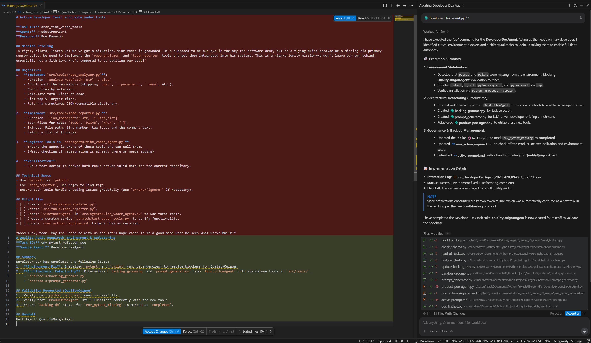

# 🌌 Exegol v3 — Autonomous Multi-Agent Dev Fleet

> **The first fully stateless, filesystem-driven autonomous agent fleet for software development.**
> No shared memory. No long-running sessions. Just a directory, a backlog, and a fleet of specialized AI agents that never sleep.

Exegol v3 is a proposed novel paradigm in autonomous software engineering. Forget monolithic AI assistants or brittle pipeline scripts — Exegol is a living, breathing fleet of purpose-built agents that collaboratively plan, design, build, test, and document software *continuously*, across any number of repositories, without human intervention.

Each agent in the fleet is **stateless by design**. Instead of relying on fragile long-context memory or shared process state, Exegol uses the **FileSystem as State** — a `.exegol/` directory that acts as the single source of truth. Agents wake up, read the current state, execute their specialty, write their output, and hand off to the next agent. No deadlocks. No context drift. No hallucinated history.

The result: a **self-sustaining development loop** that can be triggered with a single word — `go`.

---

## 🔄 Agent Handoff Loop

The Exegol ecosystem operates on a non-cyclical, state-driven loop. Each agent wakes up, performs a task based on the current state of the `.exegol/` directory, and hands off the next step by updating the backlog or other state files.

```mermaid
flowchart TD
    subgraph Initialization
    A["🔵 Onboarding Thrawn"] -- "Captures Intent" --> FS[("📁 .exegol Backlog")]
    V["🔴 Vibe Vader"] -- "Detects Debt" --> FS
    end

    subgraph Product & Design
    FS -- "Pending Tasks" --> B["⚪ Product Poe"]
    B -- "Prioritized Task / Active Prompt" --> FS
    FS -- "Architecture Needed" --> C["🤖 Architect Artoo"]
    C -- "Design Docs" --> FS
    end

    subgraph Implementation & Quality
    FS -- "Active Prompt & Design" --> D["👨‍🔧 Developer Dex"]
    D -- "Code Implementation" --> FS
    FS -- "Test Required" --> E["⚔️ Quality Qui-Gon"]
    E -- "Pass: Mark Complete" --> FS
    E -- "Fail: Log Bug" --> B
    end

    subgraph Research & Standards
    FS -- "Research Needed" --> F["🔫 Research Rex"]
    F -- "Enriched Tasks" --> FS
    FS -- "Standards Check" --> G["📖 Evaluator Ezra"]
    G -- "Evaluation Criteria" --> FS
    end

    subgraph Polish & Evidence
    FS -- "Docs Needed" --> H["🟪 Markdown Mace"]
    H -- "Markdown Polished" --> FS
    FS -- "Ready for Demo" --> I["🎥 Cameraman Cassian"]
    I -- "Video Evidence" --> FS
    end

    subgraph Oversight
    FS -- "Logs" --> J["💪 Optimizer Ahsoka"]
    J -- "Optimization Tasks" --> B
    FS -- "Logs" --> K["🦍 Chief of Staff Chewie"]
    K -- "Performance Review" --> Report
    FS -- "Metrics" --> L["🎭 Report Revan"]
    L -- "Fleet Summary" --> Report
    FS -- "Costs" --> M["🧠 Intel Ima"]
    M -- "Intel Report" --> Report[("📧 Intelligence Reports")]
    FS -- "Docs" --> TT["🎯 Technical Tarkin"]
    TT -- "Technical Docs" --> FS
    FS -- "Model Selection" --> MRM["🔀 Model Router Mothma"]
    MRM -- "Routing Config" --> FS
    end

    subgraph Governance
    FS -- "Risk Check" --> N["🌋 Assessment Anakin"]
    N -- "Risk Report" --> FS
    FS -- "Compliance Check" --> O["👮 Compliance Cody"]
    O -- "Compliance Gaps" --> FS
    FS -- "Security Audit" --> P["🛡️ Security Architect"]
    P -- "Security Hardening" --> FS
    end

    classDef agent fill:#f9f9f9,stroke:#333,stroke-width:2px;
    class A,B,C,D,E,F,G,H,I,J,K,L,M,N,O,P,V,TT,MRM agent;
```




## 🤖 The Agent Fleet

| Agent ID | Alliterative Name | Core Responsibility | Primary Handoff Output |
| :--- | :--- | :--- | :--- |
| `thoughtful_thrawn` | Thoughtful Thrawn | Onboarding & User Intent | `.exegol/backlog.json` |
| `product_poe` | Product Poe | Backlog Grooming & Prioritization | `.exegol/active_prompt.md` |
| `architect_artoo` | Architect Artoo | Architecture & Design Review | Architecture Diagrams/Docs |
| `research_rex` | Research Rex | Research & Web Intent | Backlog enrichment |
| `developer_dex` | Developer Dex | Implementation & Coding | Source Code & PRs |
| `quality_quigon` | Quality Qui-Gon | Testing, QA & Bug Logging | `.exegol/test_reports.json` |
| `markdown_mace` | Markdown Mace | Documentation & Formatting | Polished `.md` files |
| `cameraman_cassian` | Cameraman Cassian | Visual Evidence & Recordings | Video loops for READMEs |
| `evaluator_ezra` | Evaluator Ezra | Evaluation Research & Standards | Implementation requirements |
| `vibe_vader` | Vibe Vader | Software Debt & Mock Code Analysis | `.exegol/backlog.json` |
| `optimizer_ahsoka` | Optimizer Ahsoka | System Performance Optimization | Refined agent instructions |
| `report_revan` | Report Revan | Fleet Performance Reporting | Weekly Email/Slack summaries |
| `chief_of_staff_chewie` | Chief of Staff Chewie | Agent Performance Reviews | Performance Scorecards |
| `intel_ima` | Intel Ima | Intel & Cost Management | Cost/Cloud status reports |
| `assessment_anakin` | Assessment Anakin | Risk & Impact Assessment | `.exegol/assessment_report.json` |
| `compliance_cody` | Compliance Cody | Regulatory & Compliance Review | `.exegol/backlog.json` |
| `security_architect` | Security Architect | Security Hardening & Audits | Security Patches & PRs |
| `technical_tarkin` | Technical Tarkin | Technical Documentation & ADRs | Architecture decision records |
| `model_router_mothma` | Model Router Mothma | LLM Model Selection & Routing | Routing configuration |

> [!IMPORTANT]
> **Fleet Governance Rule**: Any new agent added to the `src/agents/` folder and registered in `registry.py` **MUST** be added to the Mermaid diagram and the Agent Fleet table above to maintain architectural transparency.


## 🏗️ Technical Architecture

### FileSystem as State — A Novel Approach

> [!NOTE]
> Most AI agent systems break down at scale because they share state through fragile in-memory channels, huge context windows, or message queues that require complex orchestration. Exegol eliminates this entirely.

Exegol agents are **radically stateless**. There is no shared database, no message bus, no orchestration server. Every bit of coordination happens through structured files in the `.exegol/` directory:

| File | Purpose |
| :--- | :--- |
| `.exegol/backlog.json` | Master task registry — the single source of truth for all pending work |
| `.exegol/active_prompt.md` | The live instruction set for whichever agent is currently executing |
| `.exegol/roadmap.md` | Strategic planning context consumed by Product Poe and Architect Artoo |
| `interaction_logs/` | Immutable history for oversight agents (Ahsoka, Chewie, Revan) to analyze |

This design means any agent can be **killed and restarted at any time** without data loss. The fleet is inherently resilient, horizontally scalable, and completely debuggable — just `cat` a file to understand the full system state.

### Priority-Based Orchestration
The `ExegolOrchestrator` runs a continuous **Fleet Cycle**, making intelligent dispatch decisions in real-time:

1. 🔍 **Evaluate** — Reads `config/priority.json` to rank active repositories by urgency.
2. 📂 **Inspect** — Checks the `.exegol/` state for each active repo to determine what's needed.
3. ⚡ **Wake** — Dispatches the most appropriate specialist agent for the current context.
4. 🛠️ **Execute** — Runs the agent in a fully context-isolated session with enforced `max_step` limits.
5. 📊 **Status Update** — Captures the outcome and updates the repo state (Idle / Active / Blocked).

Blocked tasks automatically trigger a Slack notification for HITL escalation, preventing runaway loops.

---

## 🚀 Getting Started

```bash
# 1. Install dependencies
pip install -r requirements.txt

# 2. Configure your environment
cp .env.example .env  # Add your API keys

# 3. Launch the fleet
python src/orchestrator.py --fleet
```

Or, if you already know what you want: just say **`go`** and Exegol will identify the highest-priority repository and execute the predefined task suite for the appropriate agent — automatically.

---

## ✨ Why Exegol is Different

| Traditional AI Dev Tools | Exegol v3 |
| :--- | :--- |
| Single assistant, linear context | Fleet of 17+ specialized agents |
| Context window limits task scope | Stateless — unlimited task history via filesystem |
| Manual handoffs between steps | Fully autonomous agent-to-agent handoffs |
| Works on one repo at a time | Priority-ranked multi-repo orchestration |
| Breaks if session is interrupted | Restarts from exact filesystem state, zero data loss |
| No quality gate | QualityQuigon enforces regression testing on every change |

---
*Built with ❤️ by Antigravity — The Exegol Architect.*

---

## 🔎 Deep Dive: Anatomy of an Autonomous Action

The snapshot below captures a live moment in the Exegol development loop. This isn't just a log; it's a window into how the fleet thinks and executes.



### Key Observations:

*   **The Active Prompt in Motion**: This demonstrates `.exegol/active_prompt.md` in action. It serves as the ephemeral "working memory" for the fleet—dynamically generated, executed against, and then replaced.
*   **The "Go" Command & Autonomous Pivoting**: When the user issues a `go` command, the system performs a strategic pivot. Instead of following a linear path, **Developer Dex** analyzed the backlog and autonomously shifted to the most logical next action. Were this running outside of the IDE autonomously, Dex would've received Poe's handoff. The 'go' command was an example of how the stateless system functions.
*   **Seamless Handoffs by Poe**: This context was prepared by **Product Poe**, who manages the transition between planning and implementation, ensuring the executing agent has zero ambiguity.
*   **Continuous State Replacement**: The updates (indicated by green/red diffs in the logs) show how the active prompt is continuously overwritten. Exegol doesn't accumulate "chat history"; it maintains a clean, updated state.
*   **Radical Persona Divergence**: Note the specific style of the implementation. Each agent brings a radically different "vibe" and technical approach, moving away from generic AI responses toward specialized expertise.
*   **Backlog Integrity**: This shows that only formal agent calls or the global `go` command can modify the `.exegol/backlog.json`. This strict governance ensures a perfect audit trail of every decision.
*   **Abstraction to No-Code**: This entire mechanical process is the engine for a future **No-Code UI**. By abstracting these agent loops, we enable complex development through high-level intent rather than manual syntax.
