# 🌌 Exegol v3

Exegol v3 is an autonomous, priority-based agent fleet designed for continuous development and maintenance of multiple repositories. It uses a "FileSystem as State" philosophy, allowing specialized agents to coordinate handoffs without shared memory or long-term session context.

## 🔄 Agent Handoff Loop

The Exegol ecosystem operates on a non-cyclical, state-driven loop. Each agent wakes up, performs a task based on the current state of the `.exegol/` directory, and hands off the next step by updating the backlog or other state files.

```mermaid
flowchart TD
    subgraph Initialization
    A["🔵 Onboarding Thrawn"] -- "Captures Intent" --> FS[("📁 .exegol Backlog")]
    V["🔴 Vibe Vader"] -- "Detects Debt" --> FS
    end

    subgraph Product & Design
    FS -- "Pending Tasks" --> B["⚪ Product Poe"]
    B -- "Prioritized Task / Active Prompt" --> FS
    FS -- "Architecture Needed" --> C["🤖 Architect Artoo"]
    C -- "Design Docs" --> FS
    end

    subgraph Implementation & Quality
    FS -- "Active Prompt & Design" --> D["👨‍🔧 Developer Dex"]
    D -- "Code Implementation" --> FS
    FS -- "Test Required" --> E["⚔️ Quality Qui-Gon"]
    E -- "Pass: Mark Complete" --> FS
    E -- "Fail: Log Bug" --> B
    end

    subgraph Research & Standards
    FS -- "Research Needed" --> F["🔫 Research Rex"]
    F -- "Enriched Tasks" --> FS
    FS -- "Standards Check" --> G["📖 Evaluator Ezra"]
    G -- "Evaluation Criteria" --> FS
    end

    subgraph Polish & Evidence
    FS -- "Docs Needed" --> H["🟪 Markdown Mace"]
    H -- "Markdown Polished" --> FS
    FS -- "Ready for Demo" --> I["🎥 Cameraman Cassian"]
    I -- "Video Evidence" --> FS
    end

    subgraph Oversight
    FS -- "Logs" --> J["💪 Optimizer Ahsoka"]
    J -- "Optimization Tasks" --> B
    FS -- "Logs" --> K["🦍 Chief of Staff Chewie"]
    K -- "Performance Review" --> Report
    FS -- "Metrics" --> L["🎭 Report Revan"]
    L -- "Fleet Summary" --> Report
    FS -- "Costs" --> M["🧠 Intel Ima"]
    M -- "Intel Report" --> Report[("📧 Intelligence Reports")]
    end

    subgraph Governance
    FS -- "Risk Check" --> N["🌋 Assessment Anakin"]
    N -- "Risk Report" --> FS
    FS -- "Compliance Check" --> O["👮 Compliance Cody"]
    O -- "Compliance Gaps" --> FS
    FS -- "Security Audit" --> P["🛡️ Security Architect"]
    P -- "Security Hardening" --> FS
    end

    classDef agent fill:#f9f9f9,stroke:#333,stroke-width:2px;
    class A,B,C,D,E,F,G,H,I,J,K,L,M,N,O,P,V agent;
```

## 🤖 The Agent Fleet

| Agent ID | Alliterative Name | Core Responsibility | Primary Handoff Output |
| :--- | :--- | :--- | :--- |
| `thoughtful_thrawn` | Thoughtful Thrawn | Onboarding & User Intent | `.exegol/backlog.json` |
| `product_poe` | Product Poe | Backlog Grooming & Prioritization | `.exegol/active_prompt.md` |
| `architect_artoo` | Architect Artoo | Architecture & Design Review | Architecture Diagrams/Docs |
| `research_rex` | Research Rex | Research & Web Intent | Backlog enrichment |
| `developer_dex` | Developer Dex | Implementation & Coding | Source Code & PRs |
| `quality_quigon` | Quality Qui-Gon | Testing, QA & Bug Logging | `.exegol/test_reports.json` |
| `markdown_mace` | Markdown Mace | Documentation & Formatting | Polished `.md` files |
| `cameraman_cassian` | Cameraman Cassian | Visual Evidence & Recordings | Video loops for READMEs |
| `evaluator_ezra` | Evaluator Ezra | Evaluation Research & Standards | Implementation requirements |
| `vibe_vader` | Vibe Vader | Software Debt & Mock Code Analysis | `.exegol/backlog.json` |
| `optimizer_ahsoka` | Optimizer Ahsoka | System Performance Optimization | Refined agent instructions |
| `report_revan` | Report Revan | Fleet Performance Reporting | Weekly Email/Slack summaries |
| `chief_of_staff_chewie` | Chief of Staff Chewie | Agent Performance Reviews | Performance Scorecards |
| `intel_ima` | Intel Ima | Intel & Cost Management | Cost/Cloud status reports |
| `assessment_anakin` | Assessment Anakin | Risk & Impact Assessment | `.exegol/assessment_report.json` |
| `compliance_cody` | Compliance Cody | Regulatory & Compliance Review | `.exegol/backlog.json` |
| `security_architect` | Security Architect | Security Hardening & Audits | Security Patches & PRs |

> [!IMPORTANT]
> **Fleet Governance Rule**: Any new agent added to the `src/agents/` folder and registered in `registry.py` **MUST** be added to the Mermaid diagram and the Agent Fleet table above to maintain architectural transparency.

## 🏗️ Technical Architecture

### FileSystem as State
Unlike traditional agent frameworks that rely on large context windows and shared memory, Exegol agents are **stateless**. Every bit of information they need is stored in the filesystem:
- **`.exegol/backlog.json`**: The master list of tasks and their status.
- **`.exegol/active_prompt.md`**: The specific instruction for the next active agent.
- **`interaction_logs/`**: Historical logs for oversight agents to analyze.

### Priority-Based Orchestration
The `ExegolOrchestrator` runs a continuous "Fleet Cycle":
1.  **Evaluate**: Reads `config/priority.json` to find active repositories.
2.  **Inspect**: Checks `.exegol/` state for each active repo.
3.  **Wake**: Dispatches the most appropriate agent for the current state.
4.  **Execute**: Runs the agent in a context-isolated session.
5.  **Status Update**: Captures the outcome and updates the repo status (Idle, Active, or Blocked).

## 🚀 Getting Started

1.  **Install Dependencies**: `pip install -r requirements.txt`
2.  **Configure Environment**: Set up your `.env` with API keys.
3.  **Run Orchestrator**: `python src/orchestrator.py --fleet` or type `go` for the highest priority task.

---
*Generated by Antigravity—The Exegol Architect.*
