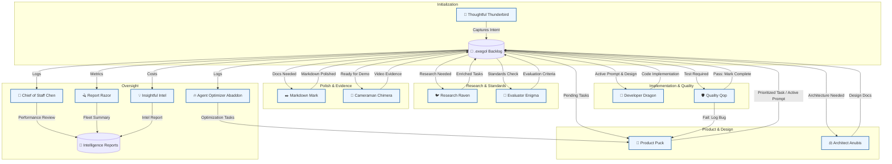

# 🌌 Exegol v3

Exegol v3 is an autonomous, priority-based agent fleet designed for continuous development and maintenance of multiple repositories. It uses a "FileSystem as State" philosophy, allowing specialized agents to coordinate handoffs without shared memory or long-term session context.

## 🔄 Agent Handoff Loop

The Exegol ecosystem operates on a non-cyclical, state-driven loop. Each agent wakes up, performs a task based on the current state of the `.exegol/` directory, and hands off the next step by updating the backlog or other state files.

## 🤖 The Agent Fleet

| Agent ID | Alliterative Name | Core Responsibility | Primary Handoff Output |
| :--- | :--- | :--- | :--- |
| `thoughtful_thunderbird`| Thoughtful Thunderbird | Onboarding & User Intent | `.exegol/backlog.json` |
| `product_puck` | Product Puck | Backlog Grooming & Prioritization | `.exegol/active_prompt.md` |
| `architect_anubis` | Architect Anubis | Architecture & Design Review | Architecture Diagrams/Docs |
| `research_raven` | Research Raven | Research & Web Intent | Backlog enrichment |
| `developer_dragon` | Developer Dragon | Implementation & Coding | Source Code & PRs |
| `quality_qop` | Quality Qop | Testing, QA & Bug Logging | `.exegol/test_reports.json` |
| `markdown_mark` | Markdown Mark | Documentation & Formatting | Polished `.md` files |
| `cameraman_chimera`| Cameraman Chimera | Visual Evidence & Recordings | Video loops for READMEs |
| `evaluator_enigma` | Evaluator Enigma | Evaluation Research & Standards | Implementation requirements |
| `agent_optimizer_abaddon`| Agent Optimizer Abaddon| System Performance Optimization | Refined agent instructions |
| `report_razor` | Report Razor | Fleet Performance Reporting | Weekly Email/Slack summaries |
| `chief_of_staff_chen`| Chief of Staff Chen | Agent Performance Reviews | Performance Scorecards |
| `insightful_intel` | Insightful Intel | Intel & Cost Management | Cost/Cloud status reports |

## 🏗️ Technical Architecture

### FileSystem as State
Unlike traditional agent frameworks that rely on large context windows and shared memory, Exegol agents are **stateless**. Every bit of information they need is stored in the filesystem:
- **`.exegol/backlog.json`**: The master list of tasks and their status.
- **`.exegol/active_prompt.md`**: The specific instruction for the next active agent.
- **`interaction_logs/`**: Historical logs for oversight agents to analyze.

### Priority-Based Orchestration
The `ExegolOrchestrator` runs a continuous "Fleet Cycle":
1.  **Evaluate**: Reads `config/priority.json` to find active repositories.
2.  **Inspect**: Checks `.exegol/` state for each active repo.
3.  **Wake**: Dispatches the most appropriate agent for the current state.
4.  **Execute**: Runs the agent in a context-isolated session.
5.  **Status Update**: Captures the outcome and updates the repo status (Idle, Active, or Blocked).

## 🚀 Getting Started

1.  **Install Dependencies**: `pip install -r requirements.txt`
2.  **Configure Environment**: Set up your `.env` with API keys.
3.  **Run Orchestrator**: `python src/orchestrator.py --fleet` or type `go` for the highest priority task.

---
*Generated by Antigravity—The Exegol Architect.*
